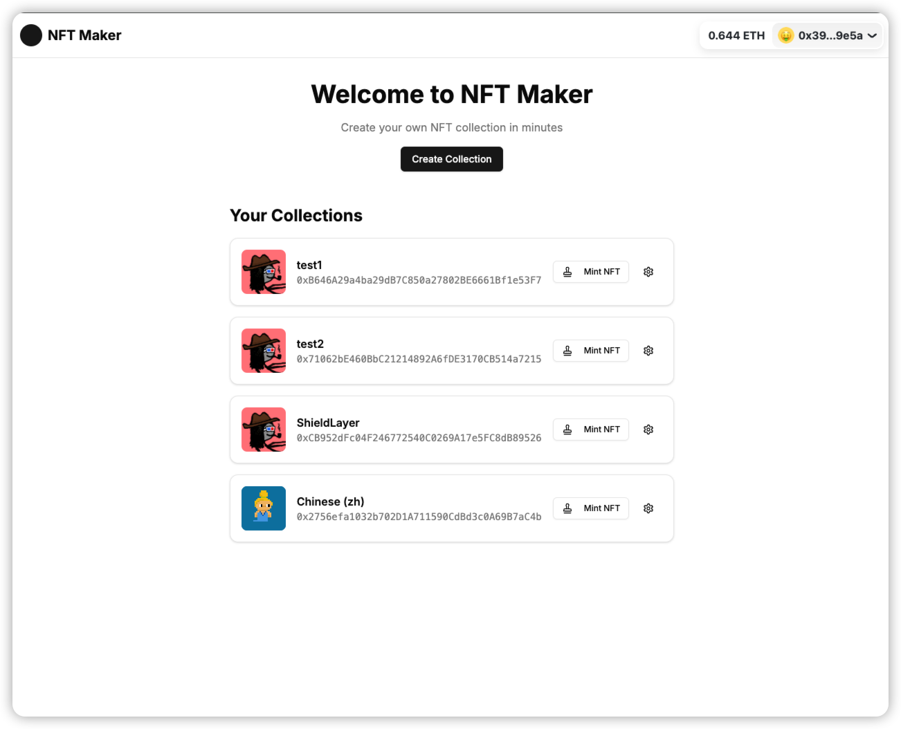

# NFT Maker

A decentralized application (dApp) that allows users to create and mint their own NFT collections on Ethereum. Built with Next.js, RainbowKit, and Wagmi.



## Features

- Create NFT collections with customizable parameters
- Set minting periods with start and end times
- Support whitelist-only minting
- Limit mints per wallet
- Upload images to IPFS via Pinata
- Track minting progress
- View your created collections

## Prerequisites

- Node.js 18+ 
- An Ethereum wallet (MetaMask, etc.)
- Some Sepolia ETH for testing

## Environment Variables

Copy `.env.example` to `.env` and fill in your values:

```bash
NEXT_PUBLIC_WALLET_CONNECT_PROJECT_ID=your_wallet_connect_project_id
NEXT_PUBLIC_GATEWAY_URL=your_pinata_gateway_url
PINATA_JWT=your_pinata_jwt
UPLOAD_PASSWORD=your_password_here
```

## Getting Started

1. Install dependencies:
```bash
npm install
# or
yarn install
```

2. Run the development server:
```bash
npm run dev
# or
yarn dev
```

3. Open [http://localhost:3000](http://localhost:3000) with your browser to start using the dApp.

## Contract Addresses (Sepolia)

- NFT Factory: `0x0Cc4FB1069F94678470653555aFCf73ff9c5530C`

## Tech Stack

- Next.js 14
- RainbowKit
- Wagmi
- Viem
- TailwindCSS
- Shadcn/ui
- Pinata SDK

## License

MIT
